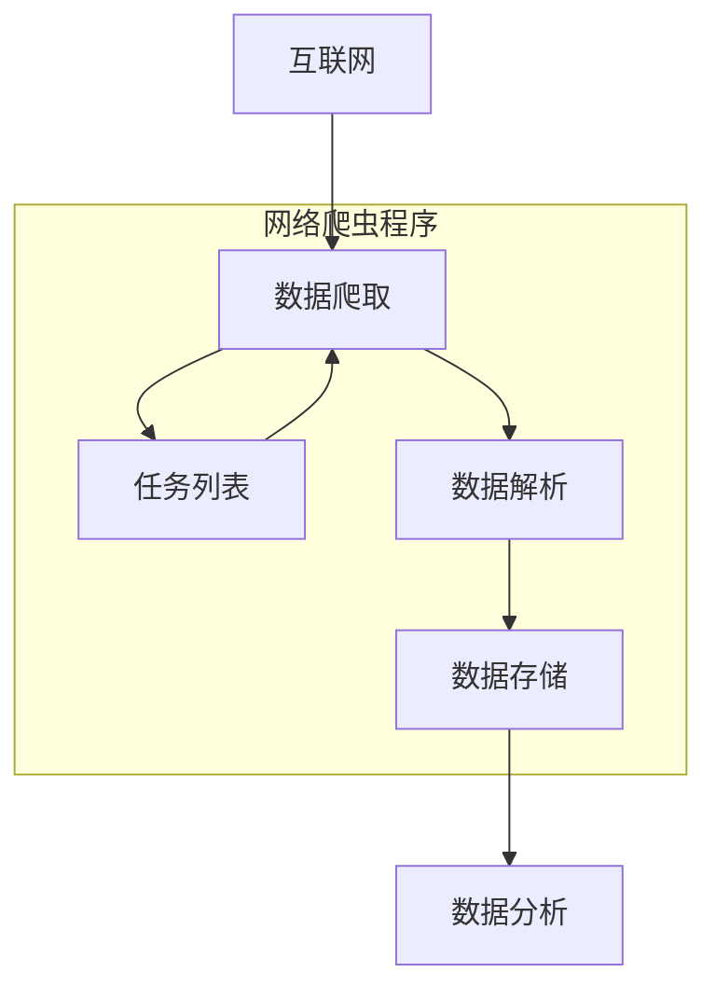

# 06|免费的宝库：什么是网络爬虫？

网络爬虫（Web Crawler）又被称为网络蜘蛛（Web Spider）。是一种自动获取互联网信息的网络机器人（Web Robot）。

## 网络爬虫合法吗？

不能触犯法律《中华人民共和国网络安全法》。网络爬虫技术本身不违法，违法的是用爬虫技术非法窃取用户数据，攻击网站，恶意与竞争对手商业竞争。

主要能够爬取的数据：

1. 数据发布者已经决定公开的数据，例如：暴露了API
2. 用户无需创建账户或登录即可访问的数据
3. 该网站的robot.txt文件允许访问的数据

## 网络爬虫的商业价值

### 信息聚合

将某个领域中有价值的数据整合起来

### 行业见解

将整合起来的数据进行分析，然后提炼出来有价值的点。

### 预测

放大信息的价值，根据信息未来进行预测。

### 机器学习

机器学习是需要大量的训练数据的，爬虫可以为机器学习提供训练的语料。

## 网络爬虫的技术栈

### 数据爬取协议

网络爬虫的第一步就是爬取数据。爬虫程序根据一个初始化的任务列表，收集对应网站上的数据。过去一般是HTTP协议，现在更多的是HTTPS协议。

HTTP和HTTPS本身是基于TCP协议实现的，域名解析还涉及到DNS解析。

### 数据爬取策略

深度搜索或广度搜索，这都需要根据自己的业务需求进行设计。

### 数据解析

爬虫获取到的一般是HTML文件，所以必须了解前端知识：HTML、CSS、JS、图片。常用的数据解析工具和方式有：

- 语言标准库对基本字符串进行处理，例如Go语言中的string包，strconv包
- 正则表达式对复杂文本进行复杂规则的匹配
- XPath遍历XML文档节点
- CSS选择器获取指定HTML标签中的数据
- 自然语言处理

同时需要将爬取出来的数据格式化为结构体。

### 数据存储

爬取的数据，需要根据数据量和业务需求选择数据存储的方式：

- 数据量小，考虑文件存储：Excel、CSV存储，
- 数据结构确定，关系清楚：可以使用关系型数据库
- 数据结构待扩展：使用MongoDB类似的面向文档的非关系型数据库
- 只存在key-value形式的数据：DynanoDB这样的键值数据库
- 数据关系复杂：Neo4J和JanusGraph这样图形数据库
- 数据主要用于决策、不需要太强的实时性，涉及大量数据的读写和写入，可以考虑使用ClickHouse这样的OLAP场景

### 数据分析和可视化

常用的技术：

- Excel
- Tableau、Microsoft Power BI
- R：
- Python：

## 常见的反爬虫措施

### IP校验

IP校验是根据IP地址在一段时间内达到请求次数的限制后采取限流、禁止等方式封禁IP。常用的规避方式是：1.降低频率，2.采用代理IP池

### HTTP Header校验

有些服务器会校验HTTP请求头中的`User-Agent`字段。User-Agent字段用于表明当前正在使用的应用程序、设备类型、操作系统及版本、
CPU类型、浏览器及版本、浏览器渲染引擎等。

常见的规避方式是动态传入User-Agent的值。

### 验证码

验证码的全称是：自动区分计算机和人类的公开图灵测试（CAPTCHA）。常见的验证码有：数字验证码、字母数字验证码、字符图形验证码。
简单验证码可以通过打码平台解决。

### 登陆限制

当用户需要访问重要数据时，要求用户进行登陆。常用的方式是：提前登陆，使用用户的Cookie进行身份验证。

### CSS数据伪装

借助CSS渲染HTML的方式规避爬虫，让爬虫获取到数据是错误的。

### sign数据签名

请求中对参数和时戳进行签名，服务端只接受一段时间内的查询参数。