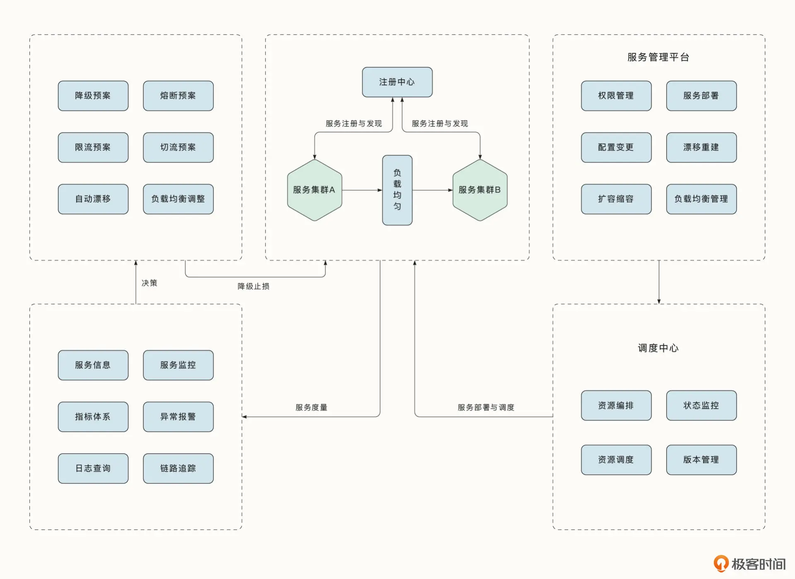

# 11|微服务挑战：微服务体系治理与实践

## 分布式日志与监控

在微服务架构中，由于大量的服务分散在各处，面临的第一个挑战就是要集中收集系统产生的日志信息，这也是下一步完成监控、分析的基础。业界常用的做法是使用
一个agent服务（典型工具Flume、Filebeat、Logstash、Scribe），监听并增量采集日志数据到消息中间件，下游引擎会实时处理数据，并将数据存储到对应的
数据，等待下一步处理。典型的日志采集与监控链路如下：

常见的做法是将清洗后的数据保存到ElasticSearch中，ES的优势是：开源、可扩展、支持倒排索引、全文本搜索，检索效率高，结合Kibana还可以对数据进行可视
化处理。对于数据量大的，还可以选择落盘的数据库比如：HBase、ClickHouse等。对于结构良好并数据量确定的还可以选择MySQL、PostgreSQL来存储。

这些数据可以用来进一步分析、也可以用来建立业务体系指标的监控。指标体系利用得好，可以有效识别系统的异常。

## 分布式Metric与监控

需要聚合服务本身的信息，包括：

- 容器与宿主机系统资源利用率（CPU利用率、CPU用户态使用率、CPU内核使用率、内存使用率、内存占用量、磁盘利用率、磁盘读写吞吐量、磁盘读写次数、进程端口监控、线程数量、进程数量、网卡出入带宽）等;
- 服务自身错误率（自身核心接口错误率、下游接口错误率、基础服务错误率等）
- 服务延迟（接口平均与P99延迟、下游平均与P99延迟）
- 服务请求量（当前接口请求量、下游接口请求量）
- 服务运行时指标（上报服务的协程数量、线程数量、垃圾回收时间等）
- 业务指标

采集到的数据会以一定的频率上报到监控服务。这些数据会存储到时序数据库中，并有监控平台进行可视化展示。还要能够进行聚合、环比。

常用的Prometheus和Grafana。

## 分布式追踪

微服务架构面临的一个挑战是：需要及时感知到服务与服务之间的调用关系，进行调用链的跟踪。

分布式跟踪有一个重要的概念：span。span表示调用链路中的单个操作。单个服务中可能有多个span，追踪重要调用的时候就是这样的。span中可以存储多个信息，
包括：开始时间、结束时间、ID等信息。

每个span中还存储了当前调用链唯一的traceID，当前span的ID、父span的ID。当函数调用或跨服务传递时，服务会传递span的这些上下文信息，以便跟踪span
之间的调用链关系。

当前优秀的开源分布式追踪组件以jaeger为代表。

## 微服务测试

微服务测试可以分为：单元测试、服务测试和端到端测试三种。

- 单元测试：内部对单一功能进行测试，测试速度快，测试范围小。对于单元测试中的外部依赖，需要以Mock的手段进行依赖注入。
- 服务测试：将单个微服务当作黑盒，测试服务的功能。服务测试的范围比单元测试大，耗时也更久。
- 端到端测试：对整个服务进行测试。

## 微服务降级

发现问题后，需要第一时间采用手段：降级、限流、熔断、切流等手段来降低服务的影响。

### 降级

降级是服务的一种自我保护机制，指的是对一些页面或服务有策略的不处理，或者只进行简单的处理，以此释放服务器资源，保证核心业务正常高效的运行。

对于核心服务，需要梳理清楚哪些是关键依赖，哪些是必不可少的，哪些是可以降级但不影响主流程的。

### 限流

限流能够在保证自身服务正常运行的情况下，最大限度的对外提供服务。在保护自身的同时，也保护下游服务。此外，在服务出现异常故障时，限流手段也能屏蔽大量
上游流量，让服务尽快恢复。

### 熔断

熔断类似断路器，当熔断组件发现依赖服务异常时，会禁止访问依赖服务，防止依赖服务拖垮自身。

### 切流

切流是保证服务高可用、异地多活的一种方式。当某个集群异常时，将流量切换到另一个流量正常的集群上，保证服务的正常运行。

## 微服务总体架构

大型微服务架构图：

## 总结

微服务架构不是银弹，微服务架构带来了新的挑战。