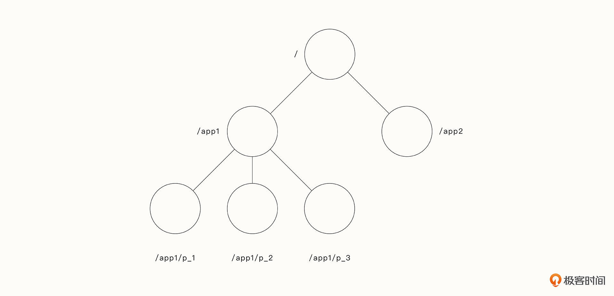

# 12-分布式系统设计：数据一致性与故障容错的纠葛

## 数据一致性的诞生背景

在微服务架构中，服务一般被细粒度的拆分为无状态的服务。无状态服务（stateless service）指的是当前的请求不依赖其他请求，服务本身不存储任何信息，
处理一次请求所需的全部信息要么包含在这个请求里，要么可以从外部（例如缓存、数据库）获取。

这种无状态的服务依赖了第三方服务，最经典的就是数据库服务，数据库服务在业务量上涨后，通常会经历几个阶段：

1. 硬件的提升：选择更高规格的配置，来搭建数据库
2. 设计优化：通过增加缓存层减轻数据库的压力、利用合适的索引设计来快速查找数据、使用监控慢查询日志优化不合理的业务SQL
3. 服务拆分：拆分服务后，子系统配置单独的数据库
4. 分库分表：通过ID取余或一致性哈希策略将请求分配到不同的数据库中
5. 数据备份：将历史数据转移到其他数据库中
6. 主从复制和读写分离：将Leader节点数据同步到Follow节点中，一般一个Leader节点负责写，其他Follow节点负责读。

数据库拆分后，带来了新的问题：数据一致性。数据一致性问题，本质是分布式架构相比单个程序而言有巨大的不稳定性。分布式系统中存在以下问题：

- 网络延迟：消息的到达有延迟，而且不确定
- 网络分区：网络可能被分割为多个互不连通的区域
- 系统故障：硬件问题、断电、内核崩溃导致的机器故障
- 不可靠的时钟：无法依靠绝对的时钟来确定操作的顺序

数据一致性有两种：

- 最终一致性：在网络连通的情况下，数据最终会达到一致，但是中途有可能读到过时的数据
- 强一致性：强一致性比最终一致性严格，是线性一致性。指的是在更新完成后后续的访问都会返回更新的值

在数据库的主从一致性中，强一致性可以要求读写都由Leader节点实现，或者是Follow节点必须复制完Leader节点后才能继续下一步动作。这样就会引出新的问题，
可用性难题。

## CAP定理

CAP定理的三个具体属性来说：

- C（Consistency）：线性一致性;
- A（Availability）：可用性，即一个节点不可用时，其他节点依然能够正常工作，并对每一个接收到请求给出响应
- P（Partition tolerance）：分区容忍度，指能够容忍任意数量的消息丢失

CAP理论证明，在异步网络中，这三个属性不能同时获得。这三种属性排列组合，能够达到CP、AP、CA三种系统，由于分布式系统无法保证网络的可靠性，实际上面临
的是CP系统或者AP系统，即：线性一致性和可用性之间权衡。在分布式设计中，需要在线性一致性和可用性之间需要进行妥协。

## 共识算法

共识算法保证系统中的大部分节点能够就同一个意见达成一致，只有这样才能保证在小部分节点“失联”时，保证大部分数据可用，同时又保证数据的正确性。

要考虑到各种可能的异常情况，还有兼顾并发的读写，达成共识不是一件简单的事情。常见的共识算法有：Paxos、Raft、Zab。

## 分布式协调服务

分布式容错和数据的一致性实现起来很困难，实践中更多选择那些优秀、经过了检验的系统，来实现分布式服务之间的协调。这种系统被称作分布式协调服务，常见的
开源项目有：Zookeeper、etcd。

以zookeeper为例，Zookeeper的数据模型类似于Unix文件系统，其中Znode是客户端通过zookeeper API处理的数据对象，Znode以路径命名，通过分层的命名
空间进行组织。

Znode包含应用程序的元数据（配置信息、时间戳、版本号），它有两种类型：

- Regular（常规的）：客户端通过显式创建和删除来操作Znode;
- Ephemeral（临时的）：此类Znode要么被显示删除，要么被自动删除（系统检测到会话终止时）

为来引用给定的Znode, 使用标准的Unix符合表示文件系统路径。除Ephemeral节点外，所有节点都能有子节点。Znode命名规则为name+序列号。一个新Znode的
序列号永远不会小于其父节点之下的其他的Znode的序列号。

zookeeper对数据一致性有一些重要保证：

- Zookeeper进行的所有读写操作都是线性一致性，可以保证优先顺序。
- 每一个客户端的操作都是FIFO的

### 分布式锁

基于Zookeeper，还能实现分布式锁，这是基于写操作的线性一致性来实现的。基本思想是每个客户端都创建一个Znode，所有Znode形成一个单调有序的队列，排在
队列前面的Znode能够获取锁，其他Znode则阻塞，陷入等待。当锁释放时，下一个序号最低的Znode能够获取到锁，这种机制还能够避免“惊群效应”。

### 配置管理

分布式协调服务也可以实现分布式系统中的动态配置。当服务启动时，连接Zookeeper获取配置信息，让Zookeeper与服务保持连接。当配置发生变更时，通知所有
连接的进程，获取最新的配置信息。

### 服务发现

分布式架构中，服务可能随时创建、随时销毁。因此当服务启动时，需要注册自己的IP等信息到注册中心。这样下游客户端可以获取最新的服务端信息，实现负载均衡。
另一种场景是监听服务的变化。

## 无信网络中的共识问题

共识算法的前提是，所有节点都是默认可信的，如果不是可信的，那么就会遇到 **拜占庭将军问题** 。意思是：在分布式系统中，当系统中的节点发送错误或者是
欺骗性的信息是，节点之间无法达成一致。

拜占庭问题是分布式系统中最难解决的问题之一。目前有很多理论用于解决拜占庭问题，其中最让人震撼、最跨时代的解决方案是比特币带来的。

比特币是化名“中本聪”的研究者提出来的。比特币系统被设计为分布式的网络，每个节点都有一份完全相同的账簿，任何人都可以直接验证区块链中的信息，不依靠
任何第三方组织就能够完成交易并保证交易的安全性。

比特币系统结合了现代密码学、应用数学和计算机科学最新成果，解决了在陌生人社会（即存在恶意的欺骗者）达成共识的难题。信任问题的解决极大地降低了社会的
交易成本，会带来一场深刻的社会变革。

比特币中使用PoW（proof of work,工作量证明）来保证比特币网络分布式记账的一致性。1993年，美国计算机科学家、哈佛大学教授
辛西娅·德沃克（Cynthia Dwork）首次提出了工作量证明思想，主要用作解决垃圾邮件问题。该机制要求邮件发送者必须计算出某个数学难题的答案，
以此证明他确实执行了一定程度的计算工作，借此提高垃圾邮件的发送成本。1999年，马库斯·雅各布松（Markus Jakobsson）正式提出了“proof of work”概念。
中本聪将PoW算法引入到区块链中，巧妙地解决了共识难题。