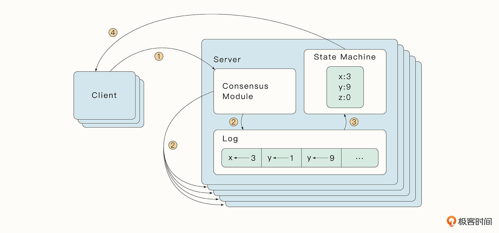
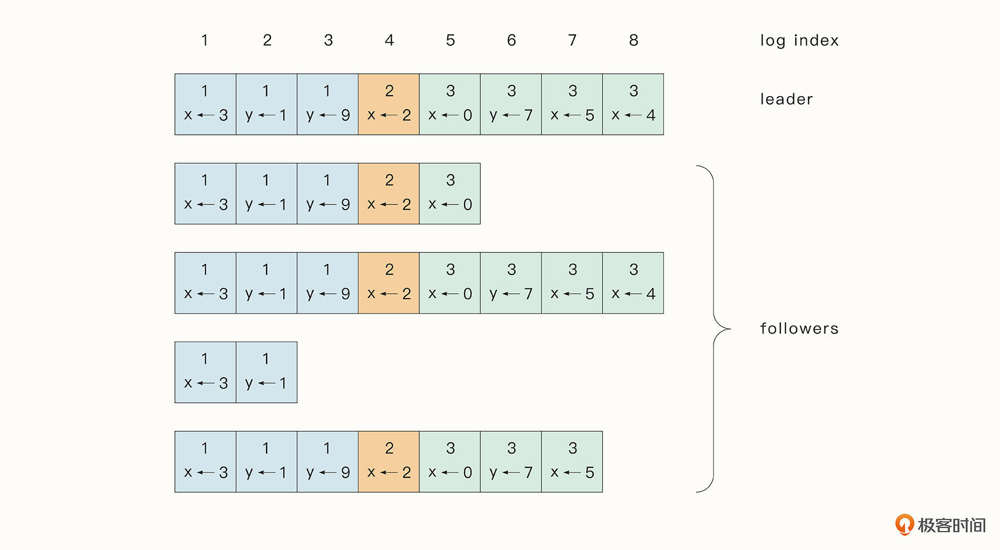

# 13-智慧之火：详解分布式容错共识算法

## Paxos算法

Paxos算法是历史悠久的共识算法，由Lamport在20世纪提出的。

Paxos算法的节点分为了三个角色：

- 提议者（proposer）：负责提出一个值
- 接受者（acceptor）：负责接受一个值
- 学习者（learner）：负责学习被选中的值

简单来说，Paxos算法可分为如下几个过程：

- 提议者选择一个提议编号n, 并把prepare请求发送给大多数接受者
- 接受者回复一个大于等于n的提议编号
- 提议者接收到回复，并记录这些回复中最大的提议编号，然后将被选中的值和这个最大的提议编号作为一个accept请求，发送给对应的接受者
- 如果一个接受者收到一个编号为n的accept请求，那么除非它已经回复了一个编号比n大的prepare请求，否则它会接受这个accept请求
- 当接受者接受一个提议后，它会通知所有learner这个提议，最终所有的节点都会就一个节点的提议达成一致。

Paxos算法的核心思想是，通过proposer提前与大多数acceptor进行一次交流，让proposer提前感知当前提出的值是否可能被大多数acceptor接收。如果不能，
则改变策略后再继续进行协调，最终让接受者就某一个值达成共识。Paxos通过一个提议编码保证了后面被接受的值一定是编号更大的值，从而实现了写操作的线性
一致性。

## Raft算法

Paxos算法难以理解，在工程上也不好实现，所以不太常用，Raft算法就是在这个背景下诞生的。Raft算法简单、容易理解、易于实现，已经成为现代多数分布式系统
（etcd、TiDB）采用的算法。

Raft算法实现了一种复制状态机。分布式中每个节点存储了一份包含命令序列的日志文件，这些文件通过复制的形式传播到其他节点中。每个日志文件包含同样的命令，
同样的执行顺序，当节点接收到这些日志文件后，将会按顺序执行命令并产生相同的状态，最终所有状态机都将达到一个确定的状态。

在Raft算法中，每个节点会维持一份复制日志（Replicated Log），复制日志中存储了按顺序排列的条目（Entry），用户执行的每一个操作都将生成一个条目，
稍后这个条目会通过节点之间的交流复制到所有节点上。

如果一个条目是被大多数节点认同的，那么这种条目被称为Committed Entry，这也是节点唯一会执行的条目类型。各个节点只要按顺序执行复制日志中的
Committed Entry，最终就会达到相同的状态。

Raft算法的核心思想就是，保证每个节点具有相同的复制日志，进而保证节点的最终态一致。

### 基本原理

Raft中节点有三种状态：领导者（Leader）、候选人（Candidate）、跟随者（Follower）。

Leader是大多数节点选举产生，并且节点状态可以跟随时间发生变化。某个Leader节点在领导期间被称为任期（Term）。新的Term是从选举Leader时开始增加的，
每次Candidate节点开始新的选举，Term都会加1。

如果Candidate选举成为了Leader，意味着它变成了这个Term后续时间的Leader。每一个节点会存储当前的Term，如果某一个节点当前的Term小于其他节点，
那么节点会更新自己的Term为已知的最大Term。如果一个Candidate发现自己当前的Term过时了，那么就会立即变为Follower。

一般情况下（网络分区除外）在一个时刻只会有一个Leader，其他的都是Follower。Leader会处理所有的客户端写请求，如果请求发送到Follower，
也会转发给Leader进行处理。将操作作为一个Entry追加到复制日志中，并将复制日志复制到所有节点上。Candidate是节点选举时的过渡状态，用于给自己拉选票。
（这一套真的很像美国的选举）

Raft通过RPC（Remote Procedure Cal，远程过程调用）来进行通信。Raft指定了两种方法用于节点的通信，其中，RequestVote方法由Candidate在选举时
使用，AppendEntries则是Leader复制Log到其他节点时使用，同时也可以用于心跳检测。RPC方法是可以并发并支持失败重试的。

### 选举与任期

在Raft中有一套心态检测机制，只要Follower收到Leader或Candidate的信息，它就会一直保持为Follower的状态。如果Follower一段时间没有收到RPC请求，
新一轮的选举机会就来了。这时Follower会将当前Term加1并过渡到Candidate状态，并发送RequestVote请求给其他节点进行拉票。

Candidate状态会持续，直到下面三种情况发生：

- 如果这个Candidate获得了大部分Follower的支持，赢得选举变为Leader。一旦它变为Leader，这个新的Leader节点就会向其他节点发送AppendEntries RPC请求，确认自己的Leader地位，停止选举
- 如果其他节点成为了Leader。它会接收到其他节点的AppendEntries RPC。如果发现其他节点的Term比自己的大，则会变为Follower状态
- 如果有许多节点同时变为Candidate，则可能会出现选举超时

为了快速修复第三种情况，Raft规定了每一个Candidate在选举前会重置一个随机的选举超时（Election Timeout）时间，这个随机时间会在一个区间内。

随机时间保证了大部分情况下，有唯一一个节点首先选举超时，它会在大部分节点选举超时前发送心跳检测，赢得选举。如果一个Leader在心跳检测中发现另一个节点
有更大的Term，则会变为Follower，否则将一直保持Leader状态。

### 日志复制(Log Replication)

一个节点成为Leader后，会开始接受客户端的请求。每一个客户端请求都包含一个节点的状态机将要执行的操作（Command）。Leader会将这个操作包装为一个
Entry放入到Log中，并通过Append Entries RPC请求发送给其他节点，要求其他节点把这个Entry追加到log中。

当Entry并复制到大多数节点之后，也就是被大部分节点认可后，这个Entry就变为Committed。Raft算法会保证Committed Entry一定能够被所有节点的状态机执行。

一旦Follower通过RPC协议知道某一个Entry被Commit了，Follower就可以按顺序执行log中的Committed Entry。

log理解为Entry的集合。Entry中包括了Command命令，Entry所包含的Term，以及每一个Entry的顺序编号。

Raft节点在日志复制的过程中需要保证日志数据的一致性。要实现这一点，需求确认下面几个关键属性：

- 如果不同节点的log中的Entry有相同的index和Term，那么它们存储的一定是相同的Command;
- 如果不同节点的log中的Entry有相同的index和Term，那么这个Entry之前所有的Entry都是相同的。

为了让数据保持最终一致，Raft算法会强制要求Follower的复制日志和Leader的复制日志一致，这样一来，Leader必须维护一个Entry Index。在这个Entry 
index之后都是和Follower不相同的Entry, 在这个Entry之前都是和Follower一致的Entry。

Leader会为每一个Follower维护一个next index, 记录着将要发送给Follower的下一个Entry的序号。最后，Follower会删除掉所有不同的Entry，并保留
和Leader一致的复制日志，这一过程通常通过AppendEntries RPC完成。

Raft使用一种简单的方法。Raft为Leader添加了几个限制：

- 要成为Leader必须保护过去所有的Committed Entry;
- Candidate要成为Leader，必须经过大部分Follower节点的同意。而当Entry成为Committed Entry时，表明该Entry其实已经存在于大部分节点中了，所以这个Committed Entry 会出现在至少一个Follower节点中。因此我们可以证明，当前Follower节点中，至少有一个节点是包含了上一个Leader节点的所有Committed Entry的。Raft算法规定，只有当一个Follower节点的复制日志是最新的（如果复制日志的Term最大，则其日志最新，如果Term相同，那么越长的复制日志越新），它才可能成为Leader。