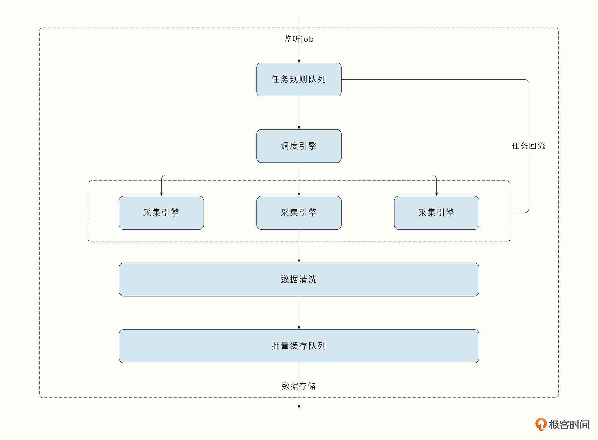
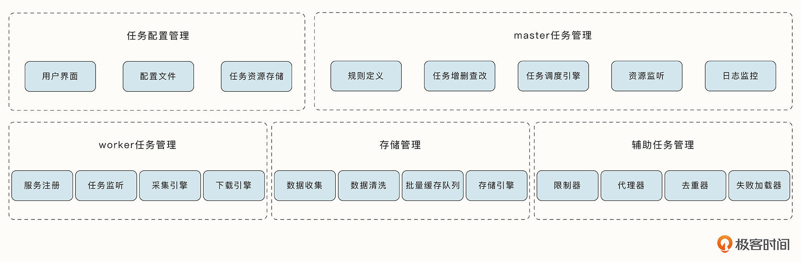
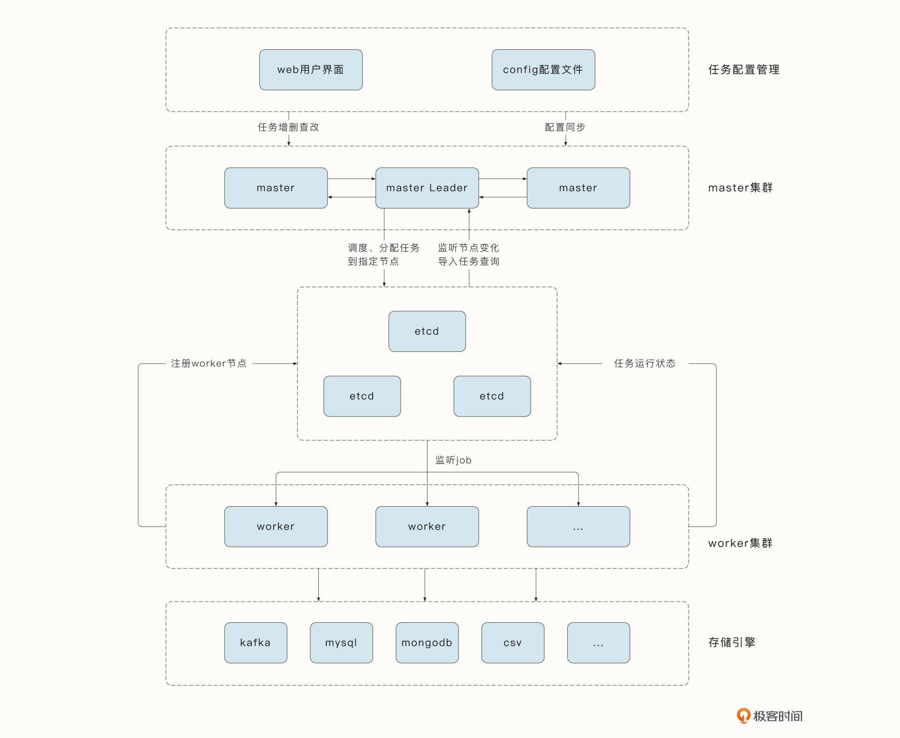

# 14-谋定后动：爬虫项目需求分析与系统架构设计

## 需求分析与调研

原始需求：爬虫聚合各个主流媒体的头条新闻，目的是快速获取用户关心的爆炸性新闻，帮助用户快人一步在资本市场上做出反应。
借助机器学习等手段感知到某一类词条和事件传播的速度，精准把握它们可能掀动舆论的时间节点，帮助用户做一只资本市场上的“春江鸭”，提前反应。

将原始需求初步拆分为：业务需求、用户需求和功能需求。

- 对于业务需求来说，应该关注需求方希望做什么。这里希望构建一个以爬虫引擎为基础的推送系统，为资本市场上的用户提供快速的热点事件和事件预警
- 对用户需求来说，要关注用户对系统的期待。在这里，用户希望能够快速了解自己感兴趣的最新新闻，并有准确的事件预警机制，帮助自己快速决策。

进一步分析业务需求和用户需求，梳理出系统需要具备的流程和关键环节：

- 用户填写或选择自己感兴趣的话题、感兴趣的网站还有消息推送的频率。
- 用户接受最新热点事件的推送
- 用户可以通过点击获取与该事件相关联的事件预测、预警，甚至可能在网站中快速交易
- 用户可以查看历史记录，可视化呈现某一个事情的来龙去脉，并进行复盘

重点是爬虫引擎的设计，可以分为两部分：一部分是引擎需要具备的功能性模块，它是从产品需求拆分而来的；另一部分是非功能性需求，例如产品的可用性、可
扩展性的要求，通常是隐含在需求当中。

## 功能模块设计

任务来源：1. 提前配置的网站，也就是种子网站; 2. 用户自定义的任务。所以，**任务模块** 就出来了，负责任务的管理，包括：增删查看的接口

任务解析：有了任务数据，就需要去处理任务，爬虫任务一般有对应的爬取规则，规则一般是复杂且可能有关联的。所以，**规则引擎模块** 就出来了，
负责任务规则的解析与处理

任务执行：解析完任务的规则，该开始执行任务了，执行任务需要 **采集引擎模块**，因为网站的爬取方式不同，采集模块自然是多态的。哪些任务应该被执行？
在哪执行？这些是采集模块无法决定的，那么就需要一个 **调度引擎模块** 来负责采集引擎模块的调度。在采集引擎的基础上，还会有一些辅助的任务管理模块。
这些模块包括，限制器、代理器、去重器、随机UA、任务优先级队列、失败处理器。其中，限制器负责控制任务的采取频率；代理器用于隐藏源IP，
突破服务器的反爬机制；去重器用于避免重复任务；随机UA用于生成随机的User-Agent；任务优先级队列用于为任务分级，高优先级的任务先执行；
失败处理器可以处理采取失败后的重试问题。

数据清洗：采集引擎模块采集到的数据格式不一、质量不同，所以需要 **数据清洗模块** 进行数据的清洗，保证数据的可用性。

数据存储：清洗完后的数据，需要进行持久化，这个时候就需要 **数据存储模块** 来根据采集的数据种类不同，存储到不同的目的地。同样，数据存储模块也是多态的。

## 非功能性模块

非功能性模块首先要考虑的就是扩展性。希望服务能够跟随任务数量的增加而扩展，能够快速增加worker程序的数量，这就要求了worker是无状态的，且所有
worker具有相同的行文。

worker是无状态的，那么怎么知道自己需要执行的任务？需要一个master来调度，所以：**Master-Worker架构模式** 就出现来。master为了高可用，需要
多个节点，那么多个节点就涉及到故障时的选主。

整个非功能模块涉及的：worker节点的监听、服务发现、任务的动态分配、master选主等工作都可以交给新组件 **etcd** 来实现。

## 架构设计

系统架构图：

Master总览全局，为用户操作提供接口，并作为任务的调度器完成如下工作：

- 提供任务增删查改的API；
- 实现任务的调度；
- 动态获取和监听Worker节点的变化，实现任务动态的负载均衡；
- 借助etcd实现选主，完成可用性的保证；
- Master集群中只会有一个Leader，其他Master接收到的请求会转发到Leader中处理。 

etcd集群负责实现Master与Worker的分布式协调工作：

- 为Worker与Master实现注册中心的功能；
- 实现事件的监听和通知机制；
- 存储每个Worker需要执行的任务，这些任务由Master完成分配；
- 提供Master选主能力。

Worker负责监听任务的变化，完成具体任务的采集工作：

- 动态监听Master为其分配的任务；
- 注册服务到etcd中；
- 完成海量并发任务的爬取、解析、清洗、存储工作。