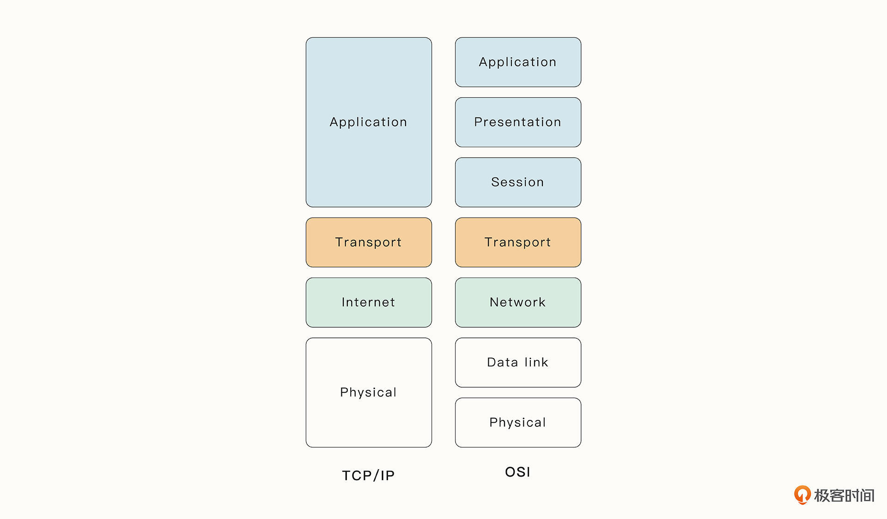
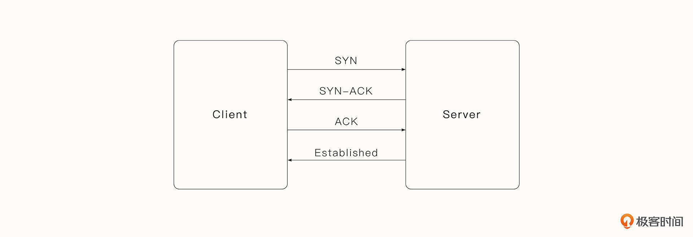
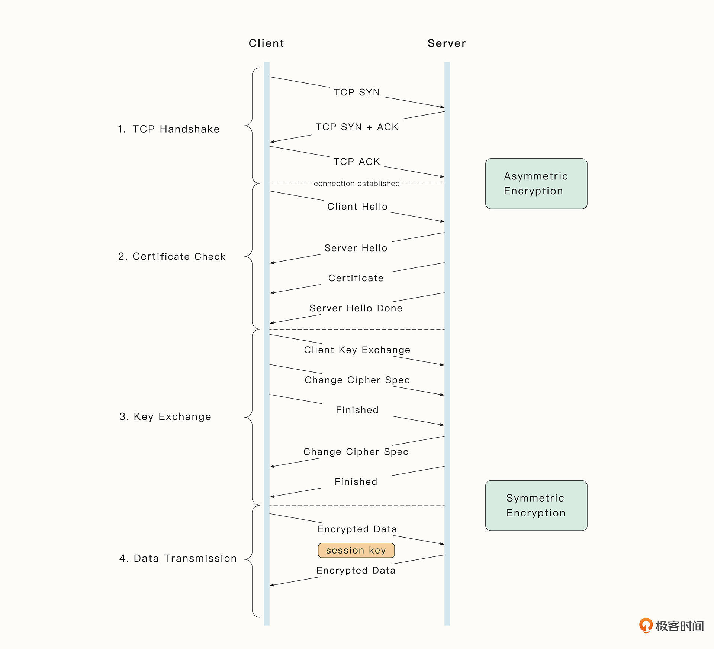

# 16-网络爬虫：一次HTTP请求的魔幻旅途

## 最简单的HTTP服务器与请求

Go语言对网络库和HTTP库的封装十分完善，最简单的服务器如下：

```go
package main

import (
    "fmt"
    "net/http"
)

func hello(w http.ResponseWriter, r *http.Request) {
    fmt.Fprint(w, "hello")

}

func main() {
    http.HandleFunc("/", hello)
    http.ListenAndServe("0.0.0.0:8000", nil)
}

```

HTTP请求服务如下：

```go
package main

import (
    "fmt"
    "net/http"
    "io/ioutil"
)

func main () {
    resp, err = http.Get("http://www.baidu.com")
    if err != nil {
        fmt.Println(err)
        return
    }
    content, err := ioutil.ReadAll(resp.Body)
    if err != nil {
        fmt.Println(err)
        return
    }
    fmt.Println(string(content))

}

```

## 分层网络模型

经典的网络模型有两种：TCP/IP 4层模型和 OSI 7层模型，他们都是分层结构，每一层都有不同的功能。
数据包从上到下逐层传递，最终，从一个系统传递到另一个系统：



OSI 7层网络模型是描述两个系统进行网络通信的概念框架，分为了：应用层、表示层、会话层、传输层、网络层、数据链路层和物理层。但是OSI模型分层太多，
被认为是无法实现，低效（某种程度上）无法实现的。所以常用作理论模型。

TCP/IP网络模型是当前的国际标准。分为来应用层、传输层、网络层、网络接入层。5层模型就是把网络接入层拆分为数据链路层和物理层。

### 应用层

在TCP/IP模型中，应用程序层依赖传输协议来建立和管理主机到主机的数据传输，应用层也是应用程序层和用户交互的地方。应用层不是真正的应用，但是提供了交互的接口。

### 传输层

传输层为应用程序提供主机到主机的可靠的数据传输服务，TCP和UDP是传输层的主要协议。传输层提供了多路复用、流量管理等多种功能。

HTTP协议就是基于TCP实现的。TCP是面向连接的协议，是可靠的，有连接时的三次握手，有断开时的四次挥手，有传输数据时与对端进行确认接受状态的ACK,还有
阻塞控制、失败重传等。



#### TLS协议

窃听、篡改和重放是HTTP协议面临的三类主要攻击。为了解决这些问题，TLS协议诞生了。主要是为了解决 **身份验证与加密**
的问题。严格来说，TLS是处于
应用层和传输层之间的3.5层协议：



### 网络层

网络层负责在互联网之间传输数据，能够执行路由、数据包的分段和重组。对于要传出的数据包，网络层通过查找路由表来选择下一跳的主机地址，然后将封装后的
数据包传递给下一个链路层。一旦数据包被目的地接受，网络层就将数据包向上传递给适当的协议层。

TCP协议的底座IP协议就位于网络层。IP地址会标识数据包传递给网络上的哪一个主机。IP地址是基于最大传输单元(MTU)进行数据包分段的。

### 网络接入层

TCP/IP模型的网络接入层涵盖了OSI模型的数据链路层的功能，也包括了主机在局域网(LAN)
中的通信协议。网络接入层目前最为广泛的协议是以太网协议(Ethenet协议)。

对于IPv4协议，解决IP动态变化的方法是ARP协议（Address Resolution Protocol），根据IP地址获取主机的MAC地址。每台机器的MAC地址是全球唯一的。

有MAC地址后，以太网会以广播的形式，将数据帧发给本地网络中的所有主机，主机网卡在接收到数据包后，会进行解包，将数据包中的目的地MAC地址比对本机MAC地址，
如果一致，则进行后续流程，如果不一致，则丢弃。

网络的分层模型按功能进行划分，将关注点有效的分离开来。一个HTTP包逐层传递，在每次向下传递时，都会进行一次封装，把上一层传递的数据包加上下一层的
Header信息，就像洋葱一样。

## 数据传输与路由协议

在数据传输过程中，如果数据包过大，可能会发生分段，目的是不让数据包的大小超过MTU。分段后的数据包会在设备的缓冲队列中，最终被设备发送出去。

数据传输过程中，可能经历多个交换机和路由器。交换机一般只处理第二层链路层的协议，而路由器可以处理第三层网络层的协议。路由器会在路由表查找下一跳
节点的IP地址。

多个路由器组成了一个自治系统（Autonomous System，AS）的实体。自治系统内主要包括RIP协议、OSPF协议、IGRP协议，这种协议被称为内部协议。而自治
系统之间的BGP协议，也被称为外部协议。

## 数据包解析

数据包通过物理介质传递给其他主机后，会发生和解包完全相反的解包过程。解包会将当前数据包层层剥离，进行校验和处理，然后传递给上一层。