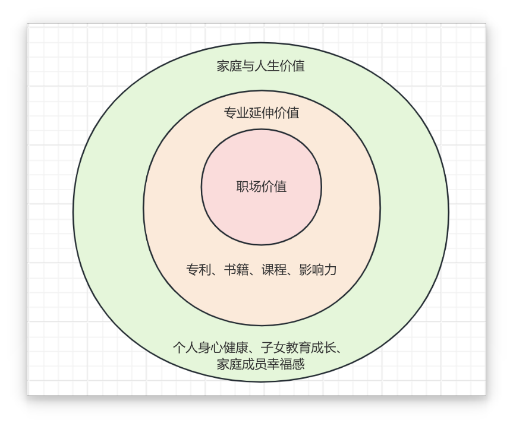

# 02-个人发展：你自己的发展才是最大的财富源泉

相比于投资理财，“个人发展”带来的自身价值的增长，才是我们应该首先关注的财富增长级。

## 个人价值的三个同心圆

一个“社会人”的价值，由三个同心圆组成。由内到外依次是：“职场价值”、“专业延伸价值”和“家庭与人生价值”。

首先是最核心的“**职场价值**”，也可以称为“**专业能力价值**”。是在社会的立身之本。

和职场价值紧密相关的是“**专业延伸价值**”，是由专业能力延伸出来的个人价值。包括：公司期权、编写的书籍、影响力等等。在做好本质工作之外，还需要
时刻提升自己的“专业延伸价值”，积攒下来的个人价值才是自己的财富。

最外层的“**家庭与人生价值**”。是我们工作奋斗的终极目标。

## 要分清楚什么是财富，什么是收入

不要混淆财富和收入的概念。收入是指你当前能够通过工作获取的，财富是能够拿到高薪的能力，能力才是个人价值。提升个人价值，管理自身的“财富金矿”，就是
持续提升自己获取高薪的能力。

## 外包消耗型工作，积累财富型资源

财富管理的思路，除了用来进行职业规划，还应该贯彻到个人发展的每个方面。本质工作上，我们要注意提升自己的专业能力价值；在业余时间，我们应该时刻注意，
提升自己的专业延伸价值。

人的精力确实是有限的，我们应该关注人生中最重要的那些事情。践行这个关键点是：“**外包消耗型工作，积累财富型资源**”。

消耗型工作是指：消耗精力却无法带来财富积累的工作。

具体方针：不要在小事上仔细，大事上糊涂。

## 要注意个人发展过程中财富自然的生发

专业延伸价值不是凭空捏造的，更多的是在个人发展过程中自然生发而来。需要在日常的工作和学习中保持思考，思考可能会出现的机会。同时，机会需要大量的
积累，不是单单靠空想就能实现的。