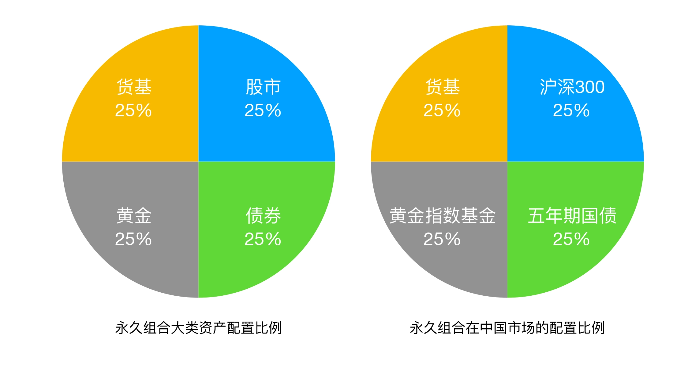

---
date:
  created:2025-08-15
---

# 03-理财金字塔：如何建立稳定的投资理财结构？

有两件事是值得做一辈子的：

1. 在自己专业方向上，精益求精;
2. 持续提高自己投资理财的能力;

## 找砖块：这个世界上到底有哪些值得投资？

标的：专业词汇，指**投资理财过程中的投资目标**。在一座投资金字塔中，最基本的砖块就是一个个独立的投资标的。

投资标的有4大类：

- "固收类"投资标的：预期收益率固定，或者波动较小的投资标的。经典有：国债、企业债等各类债券。特点是：风险相对小，收益率较低但稳定。
- "股票类"投资标的：指A股、美股、港股等各大证券市场的股票。特点是：波动大、收益高、风险高。
- "实物类"投资标的：典型代表：房产。还有原油、铁矿石等大宗商品、还有黄金、艺术收藏等等。特点是：投资金额大、流动性差。
- "新兴类"投资标的：典型代表：数字货币。特点是：未来不确定性大，流动性较差。

这四个大类，还可以从上往下细分，组成一个从小类到大类，由高层级到低层级排列的**投资标的金字塔**。

对家庭资产进行配置时，也遵循这种金字塔配置方法：

1. 在自己的理财观，也就是顶级投资逻辑指导下，先做家庭资产的顶层配置，确认上述四大类投资标的的配置比例;
2. 根据对每类资产的了解程度，做资产内部的进一步优化;
3. 落实到每一次具体操作当中。

这种自顶向下的投资方法，被称为：**“层级迭代式投资方法”**。

## 是否需要了解所有投资标的？

答案：不需要，而且也没有精力去做。

只需要遵循一个原则：要尽可能了解四大投资标的的特点，然后根据自己的兴趣和擅长的领域，有针对性地深入研究具体的投资标的。

要熟悉投资标的，有三个方法：

**方法一：趁早开始**

越早开始就能学习到更多，享受投资标的带来的好处。

**方法二：设置观察仓**

设置观察仓是指将少量的、无关痛痒的钱投入到你想观察的投资标的上。然后这部分钱会吸引你的注意力，让你去观察这个标的的风险和收益特性，做到知己知彼后再进行
进一步决策。

**方法三：结合兴趣，有重点的学习**

在广度上，对大类投资标的有一个正确的认识，同时对自己感兴趣的深入学习。这四大类投资标的，都有自己的宏观周期性规律。对于普通投资者来说，利用宏观周期
性规律来赚钱，比钻一个点，做狭隘投资重要。

```python
# TODO：基于AI学习四大投资标的的特点及宏观周期性规律
```

## 打地基：资产配置的经典组合

现代投资组合理论有诺贝尔经济学奖获得者马科维茨在1952年提出，这个理论是我们构建一个稳健的资产配置体系的基石。用一句俗语来说就是：
“不能把鸡蛋放到一个篮子里”。

经典资产配置方案：“永久组合”。由专业投资理财人哈利·布朗在1973年提出。

配置方案很简单：25%美国标普500指数基金、25%的美国十年国债指数基金、25%的黄金指数基金、25%货币基金。

对于中国来说：25%的沪深300指数基金、25%的五年期中国国债基金、25%的黄金指数基金、25%货币基金。



## 资产配置失衡，如何做到“资产再平衡”？

**要时刻关注自己的资产配置是不是平衡的。** 如果自己的资产配置严重偏向某一方，那么配置就是失衡。配置失衡后，需要根据自己的情况进行处理。