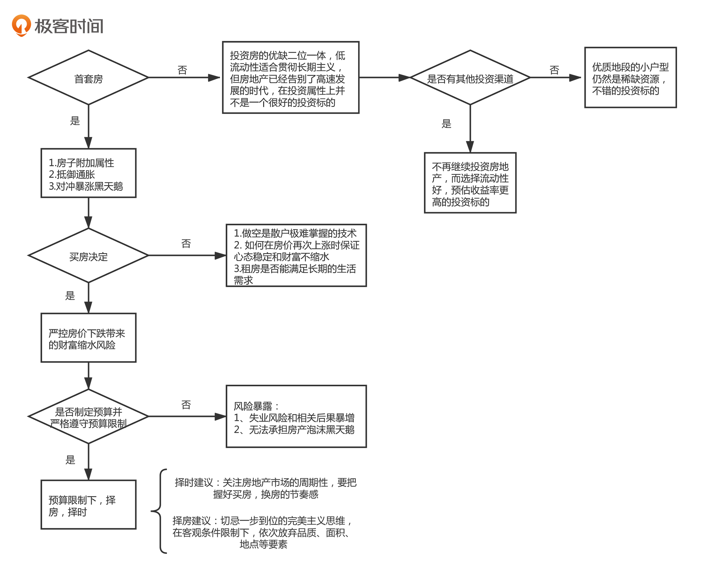

12-房产投资：如何做出理性买房决策？

房产是家庭财富的最重要组成部分，越早考虑买房的事情，离一个健康的家庭财富状态就越近。

## 首套房还是应该尽早“上车”

要不要买首套房：答案，要在“尽早”在一个“合适的时间”搭上房地产这趟车。

中国的房产，更多的有附带属性：医疗、教育、户口、住户法律保障等等。同时，从财富管理的角度来说，房地产的金融属性也大大增加了我们买房的必要性。

不要去预测中国未来房价的走势，因为普通人基本上是预测不准的。应该用风险管理的思路来解决问题，避免房价暴涨或暴跌给我们带来的问题。

在买首套房时，需要明确一点 **买这套房的目的不是赚大钱，而是对冲未来可能出现的风险。** 包括：

- 确定性风险：通货膨胀
- 不确定性风险：限购政策、利率政策、国际环境带来的房价暴涨（写的时候，目前来看短期不会，长期如同上文一般，不好预测。）

同时，要预防房价暴跌的黑天鹅事件。在买房时，应该最注意一个问题，那就是“预算问题”。

## 如何选择一套适合自己财务状况的房子

第一：**严格在自己的预算范围内选房** ， 预算一旦确定，在购房过程中不能有一丝的妥协。

**普通人的重大投资决策都要以规避风险为第一要务，要严格控制黑天鹅事件可能带来的不能承受的后果。**

第二：预算不够怎么办？可以选择投资潜力大的房子，然后通过置换。

## 购买投资性房产的逻辑应该是怎么样的？

房产标的具有流动性差的特点，最大的优点和缺点都是。

如果你有投资其他资产的能力，房地产并不是一个非常好的投资标的。如果要投资房地产：

第一：尽可能不要在房价暴涨的时候买房
第二：尽可能在房价进入稳定期后两三年内买房

## 总结

