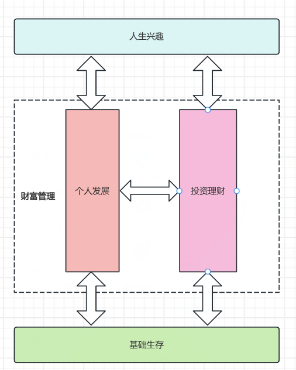

# 01-财富框架：搭建自己的财富双塔

财富双塔是整个理财知识的框架，搭建知识框架是最重要的打地基的阶段。

## 什么是财富双塔

对于普通人来说，一生要面对四个课题，分别是：“基本生存”、“个人发展、“投资理财”、“人生兴趣”。基本生存是地，人生兴趣是天，其中的个人发展和投资理财就是
天地之间的两座高塔。

理财就是为了解决：如何建立和维护“个人发展”和“投资理财”这两座高塔。

什么是财富？财富的定义不局限于金钱，而是一切有价值，能够产生收入的东西。财富可以有以下类别：

- 无需个人到场就可以正常运行的业务
- 股票
- 债券
- 能够产生收入的房地产
- 版税：如音乐、图书、专利等
- 其他任何有价值、可产生收入，或者有升值潜力的东西

人生在世，最重要的不是打工挣钱，而是积累真正的财富。需要实现从“打工者思维”到“财富管理者思维”的转变。

作为程序员，比其他职业有更好的积累

| 财富项 | 个人发展          | 投资理财            |
|-----|---------------|-----------------|
| 1   | 优质公司的技术岗位     | 能够产生收入的房地产      |
| 2   | 优质公司的关键管理岗位   | 优质公司股票          |
| 3   | 技术人脉          | 优质公司债券          |
| 4   | 自身的技术壁垒       | 黄金、石油等大宗商品类投资   |
| 5   | 技术书版权、专利、技术课程 | 任何能产生收益的交易策略    |
| 6   | 影响力资源         | 能够稳定产生收益的良好交易系统 |
| 7   | 所在公司期权、RSU等   | 其他任何有价值的投资标的    |

## 让你的财富飞轮转起来

“个人发展”这一座塔，总体上是一个人的外向能力，或者说是社会性能力的体现。

“投资理财”这一座塔，是一个人内向能力的体现。只有认识自己，了解自己，才会是一个好的投资者。

对自己的认知，尤其是**对自己的能力边界和风险承担能力的清晰认知**，是比找到任何顶级投资策略，或抢手的投资标的更关键的一件事。所以在投资时，不应该把
所有精力都投入到研究技术指标上，应该把其中一多半投入到认识自己，思考自己有那些优势和不足，想清楚自己想要什么，并且不断思考和更新。

个人发展需要外向型能力，投资理财需要内向型能力。在能力范畴上来说，个人发展和投资理财是完美互补的。从财产管理来说，又是互相支撑，互相加速的。这个
过程称为“财富飞轮”。

“个人发展”能够带来稳定的现金流，“投资理财”将现金流放大，让我们进入更健康的财富状态; 有了更健康的财富状态，才能以更好的心态投入到个人提升中，形成
良性循环。

**都应该让财富飞轮转起来，而不是卡在一边**。

## 财富飞越早轮转起来越好

要尽早让财富飞轮转起来，越早开始越好。原因是，1、越早开始尝试，试错成本越低;2、越早开始，受益时间越长，在投资路上，必须要做“时间的朋友”。

在投资行为中，**自信和淡定的投资心态，往往是投资行为中最重要的。** 仅有通过逐渐升级，从最开始少量的金额开始，逐渐建立理财体系，才能提升自己的“级别”。

## 如何平衡花在财富双塔上的时间

一定要找出时间思考财富双塔的问题，因为不思考，就无法摆脱疲于应对的处境。推荐进行82分配：

- 80%的个人提升时间：保持学习、输出笔记
- 20%的投资理财时间：学习投资经验、复盘上一周的投资状况。

原则：
1. 绝对不混淆工作时间和财富管理的时间，做坚决的隔离，防止精力分散；
2. 跟时间做朋友，保持每天短时间投入和累计的长时间的投入; 
3. 坚决坚固自己进行财富管理时间，无重大工作和个人问题时，雷打不动的在财富管理时间做财富管理的事情。