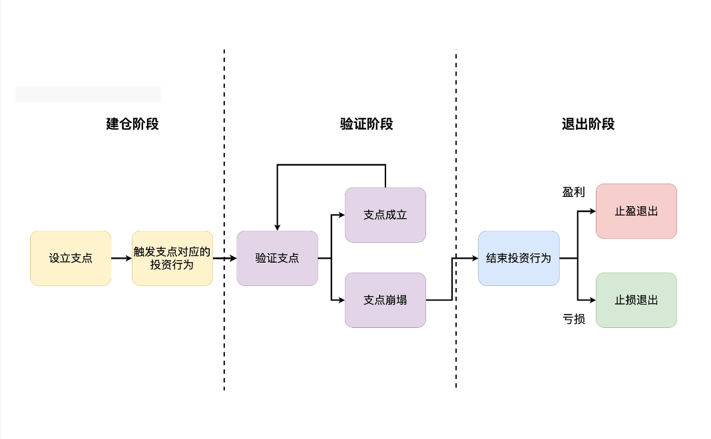

# 05-支点投资法：主动投资是讲逻辑的

## 投资公理：投资是讲逻辑的

需要弄清楚一个问题：“**所有投资行为的出发点是什么？**”

**投资行为的出发点有且只有一个，那就是“严谨的投资逻辑”。**可以把这句话看作是投资领域的公理。

## 个人情绪是所有投资者的“公敌”

在哲学领域，有一个非常重要的概念叫做EGO,即“自我”或“自我意识”。如果说严谨的投资逻辑是投资领域的公理，那么包含大量个人情绪的EGO就是投资者的公敌。

由人类EGO出发的投资逻辑是“**无效投资**”。赚了，只会在错误的路上越走越远，赔了，会造成损失，让自己怀疑自己。

## 支点投资法

所谓“支点投资法”，就是要为你所有的投资行为寻找一个逻辑支点，之后随着时间推移，不断去验证这个支点是否存在。一旦这个支点不存在，那么就要毅然结束这次
投资行为。流程图如下：

三个阶段：

1. 建仓阶段：主要任务是寻找这次投资行为的逻辑支点，然后根据这个支点，触发相遇的投资行为
2. 验证阶段：不断验证投资支点，如果支点的逻辑还存在，则继续持有当前投资。如果支点的逻辑不存在，则进入投资的退出阶段
3. 推出阶段：需要坚定的执行力，如果赚了，则盈利退出，如果亏了，亏损退出，那么投资过程也能成为宝贵的投资经验。

## 止盈和止亏的本质是什么？

到底如何做到止盈和止亏？无论是止盈还是止亏，本质上都是“**退出**”。退出的原因，有且只有一个，那就是投资支点崩塌。

什么是投资支点的崩塌：

- 为了进行一次主动投资，首先要为这次主动投资做出一个投资假设，来指导投资行为。在投资行发生后，如果这个投资假设已经不成立了，那么就该选择退出，不管是盈利还是亏损
- 在投资行为发生之前，一定要有一个投资理由或者是理论支撑。当支撑不存在时，也应该退出。
- 投资开始时，总会为我们的投资寻找一个支点，之后的所有行为都是建立在这个支点上的。当支点消失时，应该退出。

